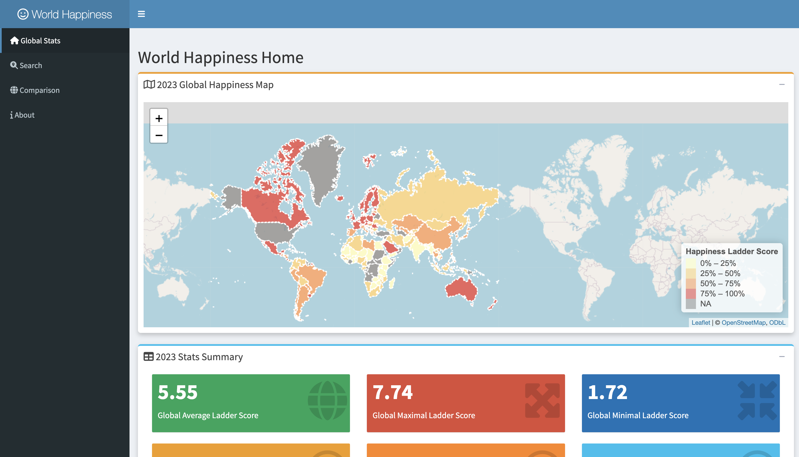
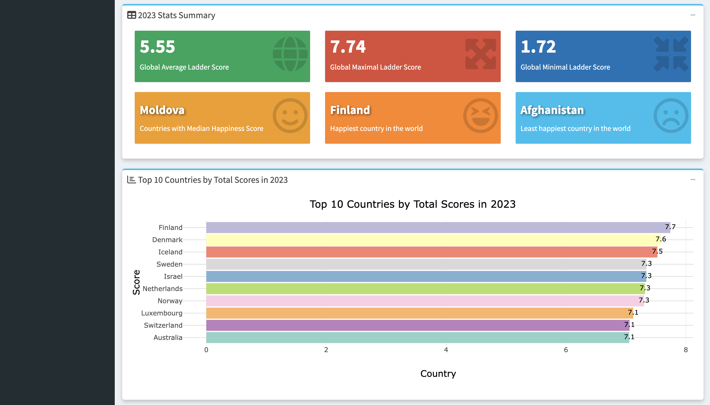
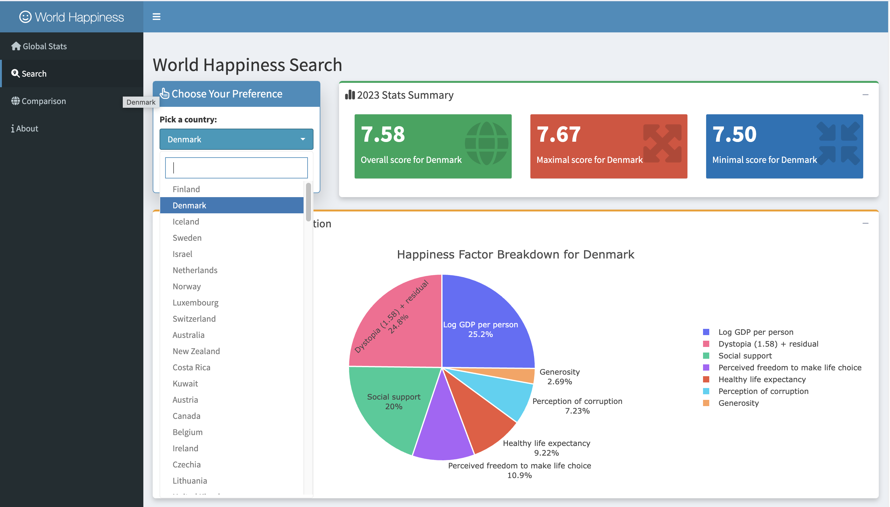
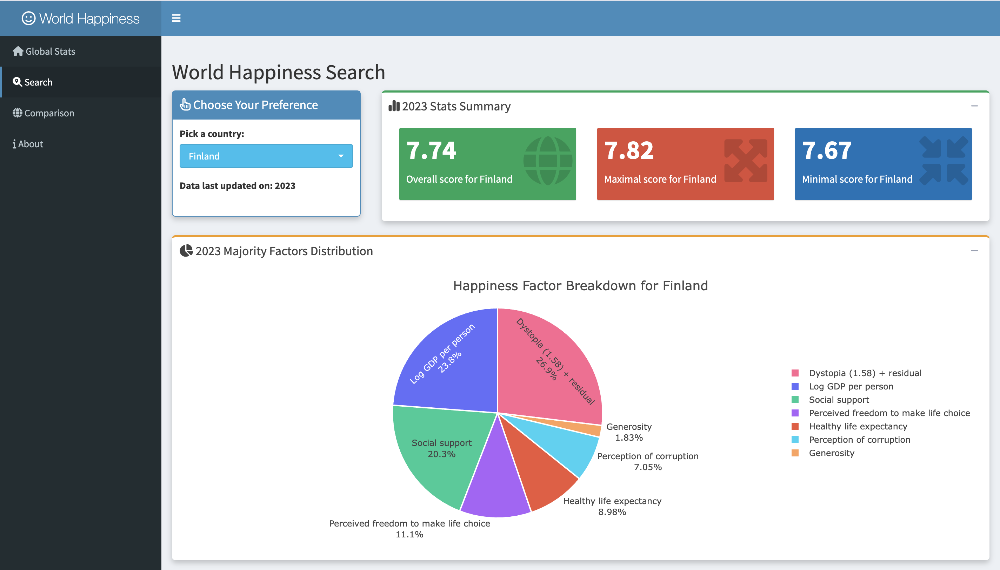
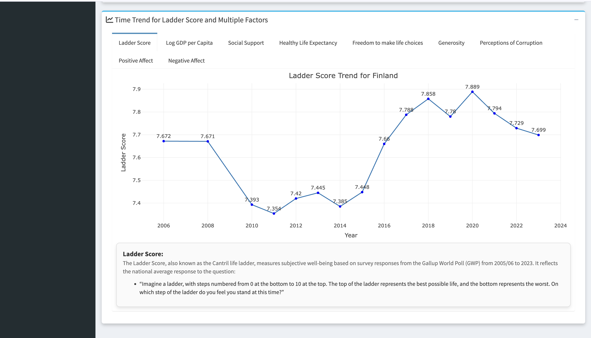
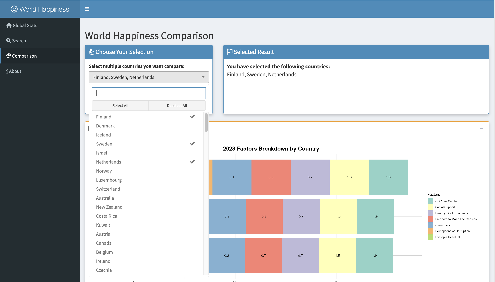
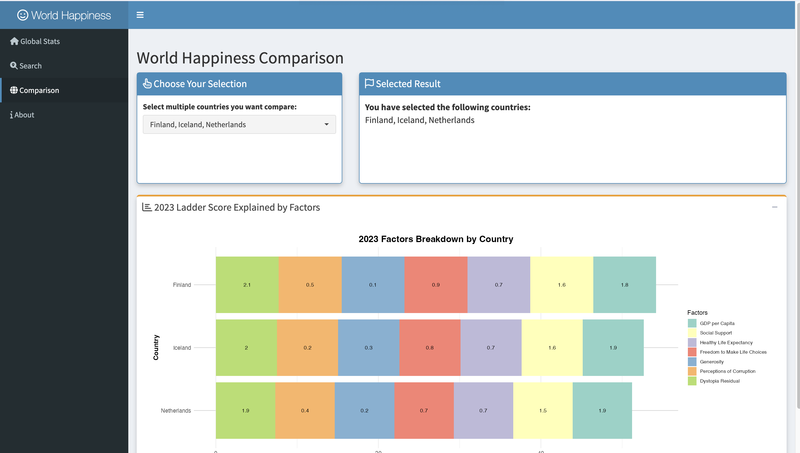
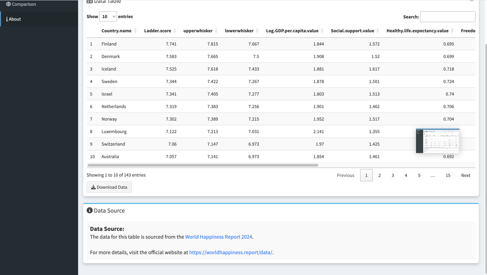

# World Happiness Analysis Dashboard – Shiny Project

This project involves creating a comprehensive **R Shiny dashboard** to analyze global happiness data based on the World Happiness Report. The dashboard allows users to interactively explore happiness trends, identify contributing factors, and compare country-level well-being metrics from 2008 to 2023.

---

## Overview

The goal is to visualize and understand patterns behind happiness scores worldwide, allowing users to explore variations by country, time, and specific influencing factors such as GDP, health, social support, and more.

The dashboard is structured with four main tabs: a global overview, a detailed country search, a comparison view for multiple countries, and an about/data tab.

---

## Key Visualizations

- **Global Happiness Map (2023)** – A choropleth map showing happiness scores by country.
- **Top 10 Happiest Countries** – A bar chart highlighting the highest-ranked countries.
- **Country Deep Dive** – Value boxes, pie chart (factor breakdown), and line charts (historical trends) for any selected country.
- **Factor Trends (2008–2023)** – Yearly trend plots for ladder score and key subfactors (GDP, freedom, health, etc.).
- **Multi-Country Comparison** – A stacked bar chart comparing multiple countries based on six happiness dimensions.
- **Raw Dataset Viewer** – Searchable, downloadable dataset view in a data table.

---

## Purpose

The purpose of this dashboard is to provide a powerful data-driven interface for exploring and comparing happiness levels across the globe. It can be used by:

- Researchers studying well-being and socio-economic factors
- Policymakers looking for insights into quality of life
- Educators and students analyzing global development trends

---

## Tools & Technologies

- **Framework**: R Shiny, shinydashboard, shinyWidgets
- **Visualization**: ggplot2, plotly, leaflet
- **Mapping**: rnaturalearth + sf
- **Interactivity**: ShinyJS, DT, CSS customization

---

## Data Sources

Data is sourced from the [World Happiness Report 2024](https://worldhappiness.report/data/):

- `Data_by_Country.csv` – 2023 cross-sectional country-level data
- `Data_by_Year.csv` – 2008–2023 time series happiness data

Each dataset includes scores for Ladder (overall happiness) and factors like:

- GDP per capita
- Social support
- Healthy life expectancy
- Freedom to make life choices
- Generosity
- Perceptions of corruption

---

## Interactive Features

- Country selector and multi-country comparison
- Pie charts and line charts with hover tooltips
- Leaflet map with color scale based on happiness score
- Downloadable raw data via `About` tab
- Styled dashboard UI with responsive components

---

## Screenshots

Below are some key screenshots from the dashboard:

### Global Stats Page

  
_Interactive map showing global ladder scores in 2023._

  
_Summary of global stats and top 10 happiest countries._

---

### Country Search Page

  
_Search a country to explore its individual happiness scores._

  
_Factor breakdown (GDP, social support, freedom, etc.) for selected country._

  
_Time-series line chart showing happiness score trends._

---

### Country Comparison Page

  
_Select multiple countries to compare happiness factors._

  
_Stacked bar chart comparing the contribution of each factor._

---

### Data & Source Page

  
_View full dataset with filter and sort options._

  
_Information on data origin and download options._


## Installation Instructions

### Prerequisites

- R (≥ 4.0)
- RStudio (recommended)

### Install Required Packages

```R
install.packages(c(
  "shiny", "shinyjs", "shinydashboard", "shinycssloaders", "shinyWidgets",
  "rnaturalearth", "sf", "ggplot2", "forecast", "leaflet",
  "dplyr", "tidyr", "readr", "plotly", "RColorBrewer", "reshape2", "DT"
))
```

### Run the App

1. Clone this repository or download the ZIP.
2. Open the project in RStudio.
3. Run the app using:

```R
shiny::runApp()
```

---

## Conclusion

This project demonstrates how interactive dashboards can bring data to life and help derive actionable insights. The **World Happiness Analysis Dashboard** empowers users to explore well-being globally, understand trends over time, and make data-informed comparisons between countries.

---